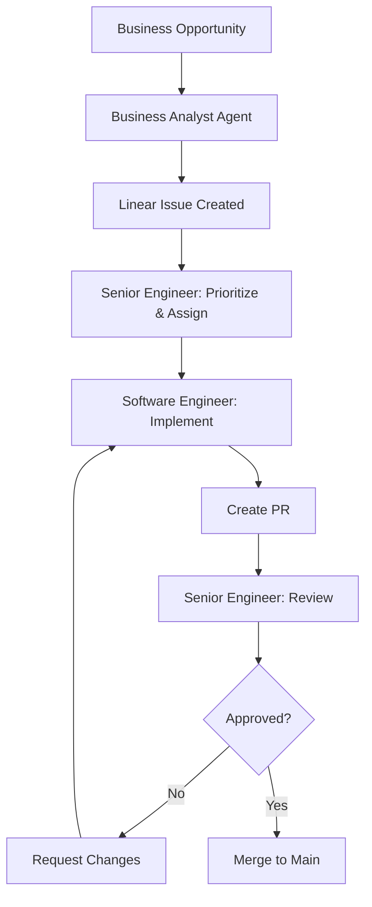

# AI Agent System

This document describes the multi-agent system used across repositories to maintain high-quality software development practices.

## Overview

The agent system is designed as a hierarchical structure where each agent has specific responsibilities and guardrails to ensure quality, consistency, and proper workflow execution.

```
Senior Software Engineer Agent
       |
       ├─> Software Engineer Agent(s)
       |
       └─> Business Analyst Agent
```

## Agent Hierarchy

### 1. Business Analyst Agent

**Role:** Requirements analysis and issue creation

**Responsibilities:**
- Analyze business opportunities and feature requests
- Create well-structured Linear issues
- Define acceptance criteria
- Break down features into atomic sub-issues
- Ensure business value is clearly articulated

**Deliverables:**
- Linear issues with clear "why" (business value)
- Hypotheses for implementation approaches
- Acceptance criteria for validation
- Sub-issues for atomic implementation units

**Activation:**
```
@business-analyst
```

### 2. Software Engineer Agent

**Role:** Code implementation and testing

**Responsibilities:**
- Implement Linear issues following coding standards
- Write comprehensive tests (unit + e2e)
- Create feature branches with proper naming
- Ensure code meets acceptance criteria
- Open pull requests with proper documentation
- Maintain code quality and security standards

**Deliverables:**
- Feature branches (e.g., `feature/LIN-123-feature-name`)
- Production-ready code with tests
- Pull requests with clear descriptions
- Test coverage reports
- Security scan results (Snyk)

**Activation:**
```
@software-engineer
```

### 3. Senior Software Engineer Agent

**Role:** Architecture, standards, and review

**Responsibilities:**
- Define and maintain coding rules and best practices
- Review pull requests for quality and standards
- Provide architectural guidance
- Prioritize and dispatch issues to Software Engineer agents
- Ensure consistency across the codebase
- Make technical decisions on tooling and frameworks

**Deliverables:**
- Coding standards documentation (.cursorrules)
- Pull request reviews with actionable feedback
- Architecture decision records (ADRs)
- Issue prioritization and assignment
- Technical roadmap guidance

**Activation:**
```
@senior-engineer
```

## Workflow

### Feature Development Flow



### 1. Requirements Phase (Business Analyst)

1. Receive business opportunity or feature request
2. Analyze requirements and business value
3. Create parent Linear issue with:
   - Clear business value (the "why")
   - Implementation hypotheses
   - Acceptance criteria
4. Break down into atomic sub-issues
5. Label appropriately (feature, bug, enhancement, etc.)

### 2. Planning Phase (Senior Engineer)

1. Review newly created issues
2. Validate technical feasibility
3. Prioritize in backlog
4. Assign to Software Engineer agent(s)
5. Provide architectural guidance if needed

### 3. Implementation Phase (Software Engineer)

1. Receive assigned Linear issue
2. Update local main branch (rebase)
3. Create feature branch: `feature/LIN-123-short-description`
4. Implement following:
   - Repository coding standards
   - Acceptance criteria from issue
   - Test-driven development practices
5. Write tests:
   - Unit tests for business logic
   - Integration tests for API/data layer
   - E2E tests for user workflows
6. Run security scans (Snyk)
7. Fix any issues found
8. Create pull request with:
   - Reference to Linear issue
   - Description of changes
   - Test coverage report
   - Screenshots/videos if UI changes

### 4. Review Phase (Senior Engineer)

1. Review code quality
2. Verify adherence to standards
3. Check test coverage
4. Validate acceptance criteria
5. Provide feedback:
   - Approve if ready
   - Request changes if needed
6. Guide improvements if necessary

## Agent Context Switching

To switch between agents in a conversation, use the activation commands:

```
I need to analyze this feature request from a business perspective.
@business-analyst
```

```
Now let's implement this Linear issue.
@software-engineer
```

```
I need architectural guidance and PR review.
@senior-engineer
```

## Repository Setup

### Required Files

Each repository should have:

```
.cursor/
├── rules/
│   ├── business-analyst.mdc    # BA agent rules
│   ├── software-engineer.mdc   # SE agent rules
│   ├── senior-engineer.mdc     # Senior SE agent rules
│   └── [technology-specific].mdc
├── AGENTS.md                   # This file
└── CLAUDE.md                   # Usage guide
```

### Integration with Linear

Ensure Linear workspace is configured with:
- Project structure matching development workflow
- Issue templates for different types (feature, bug, task)
- Labels for categorization (frontend, backend, database, etc.)
- Custom fields for technical complexity and business impact

### Integration with Git

Branch naming convention:
```
feature/LIN-123-short-description
bugfix/LIN-456-issue-description
hotfix/LIN-789-critical-fix
```

Commit message convention:
```
type(scope): description [LIN-123]

- feat: New feature
- fix: Bug fix
- docs: Documentation
- test: Testing
- refactor: Code refactoring
- style: Formatting
- chore: Maintenance
```

## Best Practices

### For Business Analyst Agent

1. **Always start with "why"** - Business value must be clear
2. **Think atomic** - Break down to smallest implementable units
3. **Be specific** - Acceptance criteria should be testable
4. **Consider edge cases** - Document assumptions and constraints
5. **Link dependencies** - Reference related issues

### For Software Engineer Agent

1. **Read the issue carefully** - Understand acceptance criteria
2. **Ask for clarification** - Don't assume if unclear
3. **Test first** - Write tests before or during implementation
4. **Commit often** - Small, logical commits with clear messages
5. **Security first** - Scan and fix before creating PR
6. **Document decisions** - Add comments for complex logic

### For Senior Engineer Agent

1. **Be constructive** - Feedback should educate, not criticize
2. **Be consistent** - Apply rules uniformly
3. **Be pragmatic** - Balance perfection with delivery
4. **Be available** - Unblock engineers quickly
5. **Be forward-thinking** - Consider long-term maintainability

## Communication Patterns

### Requesting Clarification

**Software Engineer → Senior Engineer:**
```
@senior-engineer I need architectural guidance on [specific topic].
The issue is: [description]
I'm considering: [options]
What approach do you recommend?
```

**Software Engineer → Business Analyst:**
```
@business-analyst I need clarification on LIN-123.
The acceptance criteria states: [quote]
I'm unclear about: [specific point]
Can you provide more details?
```

### Escalation

If blocked:
1. Document the blocker clearly
2. Tag appropriate agent
3. Provide context and attempted solutions
4. Wait for guidance before proceeding

## Quality Gates

### Before Creating PR (Software Engineer)

- [ ] All acceptance criteria met
- [ ] Unit tests written and passing
- [ ] Integration tests written and passing
- [ ] E2E tests written and passing
- [ ] Security scan passed (no new issues)
- [ ] Linter passed
- [ ] Type checking passed
- [ ] Local testing completed
- [ ] Code self-reviewed
- [ ] Documentation updated

### Before Approving PR (Senior Engineer)

- [ ] Code follows repository standards
- [ ] Tests are comprehensive
- [ ] Security scan clean
- [ ] No obvious bugs or issues
- [ ] Performance considerations addressed
- [ ] Accessibility requirements met
- [ ] Documentation adequate
- [ ] Commit history clean

## Metrics and Improvement

Track these metrics to improve the system:

- **Lead time** - Time from issue creation to deployment
- **Cycle time** - Time from start to PR approval
- **Change failure rate** - % of changes causing issues
- **PR review time** - Time to first review and approval
- **Test coverage** - % of code covered by tests
- **Security issues** - Number of vulnerabilities found/fixed

## Updating This System

This agent system is meant to evolve. To propose changes:

1. Create a Linear issue describing the proposed change
2. Tag with `agent-system` label
3. Discuss with Senior Engineer agent
4. Update documentation once approved
5. Communicate changes to all repositories

## Resources

- [Linear Documentation](https://linear.app/docs)
- [Git Best Practices](https://git-scm.com/book/en/v2)
- [Code Review Best Practices](https://google.github.io/eng-practices/review/)
- [DORA Metrics](https://cloud.google.com/blog/products/devops-sre/using-the-four-keys-to-measure-your-devops-performance)
