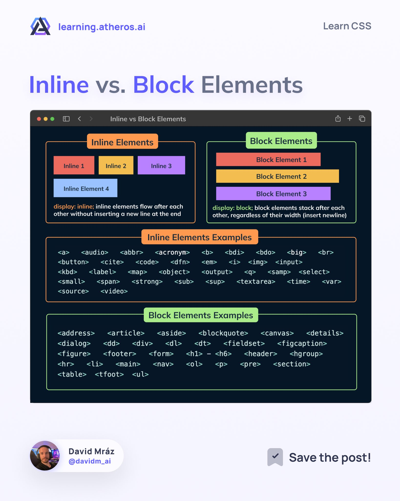

# HTML Index

https://websitesetup.org/html5-periodical-table/

## Pico CSS

https://picocss.com/

## Semantic elements

- https://x.com/ATechAjay/status/1688190190861664257?s=20

## Inline vs Block Elements

## Create Dynamic HTML Elements

- https://alan.bearblog.dev/templates-for-dynamic-html-elements/

## Never Underestimate HTML

- https://www.htmhell.dev/adventcalendar/2023/24/?ck_subscriber_id=773350220

## Always bet on HTML

- https://catskull.net/html.html?ck_subscriber_id=773350220

## Popover API

- https://codepen.io/web-dot-dev/pen/vYbadaJ

## Practice Front end

- https://www.frontendpractice.com/projects
